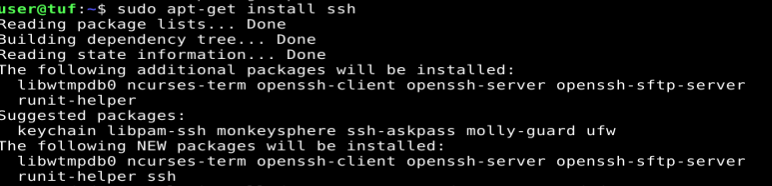
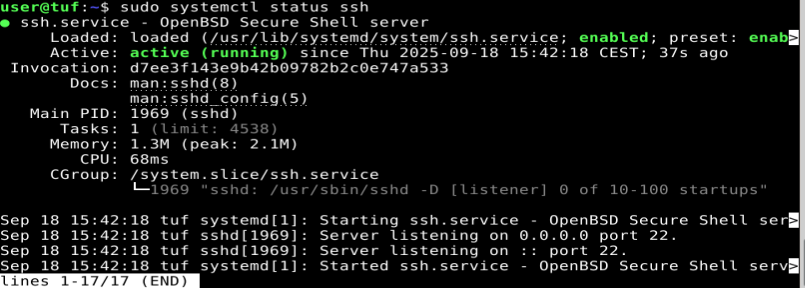
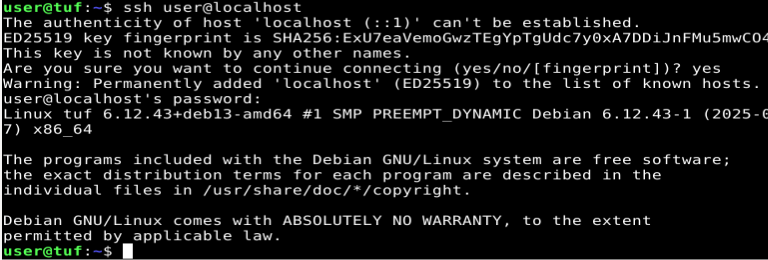
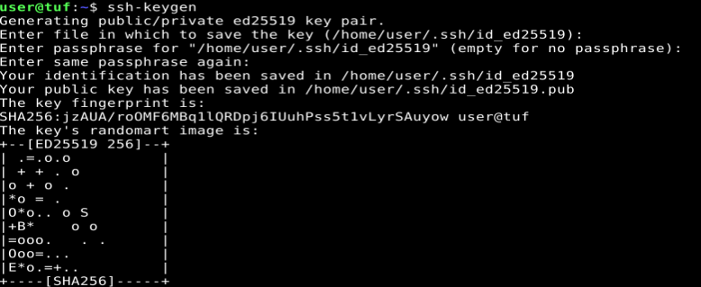
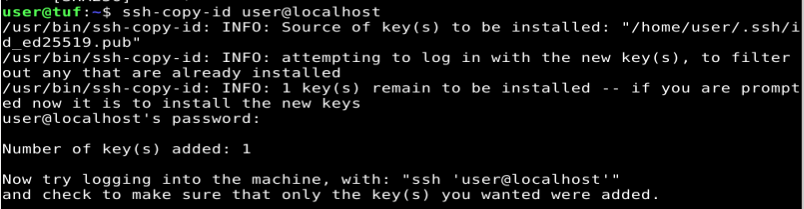
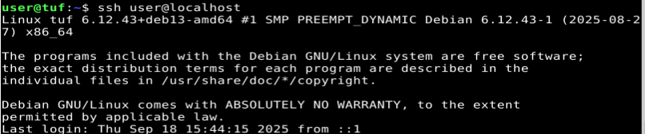
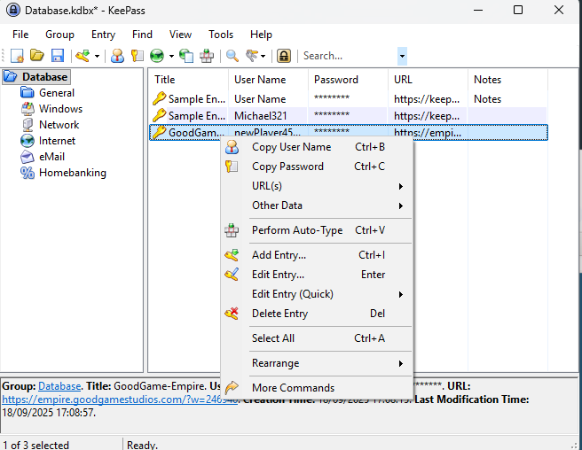
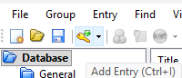
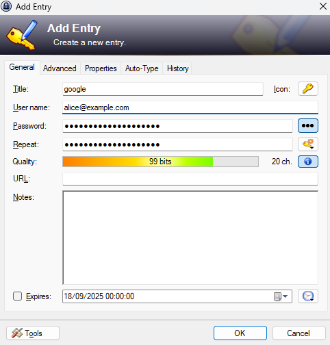

# information-security-h5
## Subtask x) Read & summarize 
### Schneier 2015: Appliced cryptography
#### 1.1 Terminology
- Special terminology:
  - cryptographers = people keeping messages secure
  - crypanalysts = people breaking ciphertext
  - cryptologysts = both cryptography and cryptanalysis -> trained in mathematics
- Symbols: 
  - M (message) or P (plaintext)
  - C (ciphertext)
  - E (encryption function)
  - D (de-encryption function)
  - E(M) = C -> encryption of message is ciphertext
- Cryptography should provide confidentiality, authentication, integrity and nonrepudiation (= sender can't deny message is from them)
- cryptographic algorithm (= cipher) is a mathematical function used for encryption and decryption. 
  - restricted algorithm = based on keeping it secret => like a secret password for a group
  - modern cryptography uses a key, so it doesn't matter if algorithm is leaked 
- symmetric algorithms (= conventional algorithm) -> encryption key can be calculated from decryption key & vice versa. sender & receiver must share the key with each other.
- asymmetric algorithm (= public-key algorithm) -> key for decryption is different than encryption. decryption = private key, encryption = public key.
- cryptanalysis = getting the plaintext without access to the key. 
  - attempted cryptanalysis is called an attack
  - 7 types: 
    - ciphertext-only, 
    - known-plaintext, 
    - chosen-plaintext (knows also some plaintext and has access to encryption, but not the key.) 
    - adaptive-chosen-plaintext (adapt attack based on results of first encryption)
    - chosen-ciphertext (can decrypt whenever, tries to find the key)
    - chosen-key attack (knows something about relationship between different keys)
    - rubber-hose cryptanalysis (threathen, blackmail or torture to give the key)
- easier to decrypt if all messages start with same beginning/ending e.g. "heil hitler" in WW2
- if it's harder / takes longer to decrypt the message than it's worth, you're safe
- algorithm is secure if it's impossible to break with available resources
- three ways to measure complexity of attack:
  - data complexity (amount of data necessary)
  - processing complexity (time needed)
  - storage requirements

#### 1.2 Steganography
= hide secret messages in other messages (e.g. invisible ink etc)  
-> currently, hiding messages in graphic images

#### 1.3 substitution ciphers & transposition ciphers
Substition: one character replaces another (e.g. a = d, b = e)  
4 types: 
- simple subtitution, e.g. example above
- homophonic subsitition: character can equal multiple outcomes, e.g. A = 1, 3, 9, or 84
- polygram substituion: characters are encrypted in groups, e.g. ABA => RTQ, ABB => SLL
- polyalphabetic substitution: multiple simple substitution together

Transposition ciphers:
plaintext remains the same, but order is shuffled around. 

#### 1.4 Xor 
Really not good for encryption

#### 1.5 one-time pads
Basically, just simple substitution for every letter. The key is as big as the message itself. but throw away the pad. Note that it has to be completely random, otherwise there's no point. It's the most secure thing as there is no real logic behind it. 


#### 1.6 Computer algorithms
- DES (most popular encryption algorithm, symmetric)
- RSA (most popular public-key algorithm)
- DSA (another public-key algorithm, but only for digital signatures)

#### 1.7 Large numbers
Putting numbers in perspective

### Karvinen 2023 - PGP - Send encrypted and signed message - gpg
- To send messages, first you need to generate a keypair and share the public key with the person that wants to send you a secret message.
- Other person also generates keypair. Other person needs to verify that public key for person 1 is really from them, so they can check their **fingerprint**.
- Verifying each others' public keys has to be done in both directions. 
- For encryption, you need to specify that you want to encrypt, who's the recipient, they can sign the message

## a) Install openssh
I've installed ssh with the following command:   
  
SSH is running on port 22:  
  
I was able to connect to my user with ssh:


## b) SSH with public keys
First, generate a keypair with ssh-keygen. Don't use any special settings, just keep pressing the Enter button.  
  
Then, copy the public key to the remote server using ssh-copy-id *user*@*ip-address*.  
  
Logging in now works without password:  
  

## c) Password manager
### How does it work
I've chosen KeePass as a password manager. It's a local, open-source password manager.  
First, you'll have to make a database file. You can choose where, even on a usb stick. The database is encrypted. You log in to the password manager with one master password.  

To use the password manager, just right-click an entry and copy the username/password. Your clipboard automatically gets cleared afterwards.  
  

You can also add a new entry by clicking on the key icon:    
  
KeePass will automatically generate a password for you. You just have to fill in the title (so for what you use it), the username and the url.  
  

With KeePass, you can also use plug-ins. An example of a plug-in is that it automatically fills in forms. 

### Why would you use it?
In an ideal world, you use a different password for each different use case. After all, if only one of the accounts gets compromised, they would have the password to all your other accounts.  
In reality, not many people do this. How can anyone remember dozens of different passwords?  
An easy way to have both very secure passwords **and** have different passwords for every use, we can use a password manager. They can generate a password for every different account to keep you secure. 

## d) Pretty good indeed
Instead of doing d), I chose to do the alternative: s)

## s) ETAOIN
Note: Spoilers incoming!  
The ciphertext is the following: 
```
HDMH'B TH. KWU'YI AWR WSSTOTMJJK M OWQINYIMLIY! MB KWU BII, BTGPJI BUNBHTHUHTWA OTPDIYB OMA NI NYWLIA RTHD SYIEUIAOK MAMJKBTB. BII KWU MH DHHP://HIYWLMYCTAIA.OWG
```

1. In english, there are only two one-letter words: 'a' and 'I'. Thus, we can conclude for certain that 'M' = a or 'M' = i.

2. MB means a? OR i? -> can be an, at, as OR in, it, is => B is either n, t or s

3. BII ends with the same two letters. Thus, 'I' must be a vowel. Based on the previous step, it can be 'see' or 'too'. Thus; B = s and I = e OR B = t and I = o

4. MH is also a two-letter word with a/i. thus, H = n/s/t.

5. TH ends with either n, s or t. Based on step 4, we can conclude that T is a vowel. 

6. If we take the last sentence "BII KWU MH ..." we can conclude that BII must be 'see'. No proper English sentence starts with "too". 

7. KWU is very often used close to "BII". "MB KWU BII" can be translated as "as/is KWU see". Context wise, 'as' makes more sense. From now on, we'll consider M = a. 
Thus, we can conclude that 'KWU' = 'you'. This also checks out with "KWU'YI" -> "you're".

8. We can see see that the last part of the last sentence is a url. It's probably http://terokarvinen.com, but we can't be certain about this. What we can assume is that DHHP is http. It checks out with our previous guess that H is either n or t. We know for certain the top-level domain has an 'o' in the middle, which leads us to think it's either .com or .gov. We'll take this in consideration, but are not certain about this.

9. At the moment, there are no further obvious words. We'll try to fill in the cipher with what we know already (including c & m):  
I used the following script for this:
```
ciphertext = "HDMH'B TH. KWU'YI AWR WSSTOTMJJK M OWQINYIMLIY! MB KWU BII, BTGPJI BUNBHTHUHTWA OTPDIYB OMA NI NYWLIA RTHD SYIEUIAOK MAMJKBTB. BII KWU MH DHHP://HIYWLMYCTAIA.OWG"

mapping = {
    'M': 'a',
    'O': 'c',
    'I': 'e',
    'D': 'h',
    'T': 'i',
    'W': 'o',
    'P': 'p',
    'Y': 'r',
    'B': 's',
    'H': 't',
    'U': 'u',
    'K': 'y',
    'G': 'm',

}

def decipher(text, mapping):
    result = ""
    for char in text:
        if char.upper() in mapping:
            result += mapping[char.upper()]
        elif char.isalpha():  # Letter but not mapped
            result += '?'
        else:
            result += char  # Keep punctuation/space
    return result

# Apply mapping
plaintext = decipher(ciphertext, mapping)
print(plaintext)
```
The output was the following:
```
that's it. you're ?o? o??icia??y a co?e?rea?er! as you see, simp?e su?stitutio? ciphers ca? ?e ?ro?e? ?ith ?re?ue?cy a?a?ysis. see you at http://tero?ar?i?e?.com
```
Based on the context, I assume the sentence will spell out: "That's it. You're now officially a codebreaker! As you see, simple substitution ciphers can be broken with frequency analysis. see you at http://terokarvinen.com".  
To be certain we're not being misled, I'll complete the full analysis.

10. Based on the previous step, we can finish some words: WSSTOTMJJK -> o**ff**icia**ll**y => S = f, J = l.    
BUNBHTHUHTWA = su**b**stitutio**n**.  N = b, A = n. 

11. Now it really comes along together:
```
that's it. you're no? officially a co?ebrea?er! as you see, simple substitution ciphers can be bro?en ?ith fre?uency analysis. see you at http://tero?ar?inen.com
```
We'll finish the cipher:  
R = w  
Q = d  
L = k  
E = q  
C = v

12. The moment of the truth: 
```
that's it. you're now officially a codebreaker! as you see, simple substitution ciphers can be broken with frequency analysis. see you at http://terokarvinen.com
```

13. Summary of all known letters: 

M = a  
N = b  
O = c   

Q = d  
I = e  
S = f  
? = g  

D = h  
T = i  
? = j  
L = k  

J = l  
G = m  
A = n  
W = o  
P = p  

E = q  
Y = r  
B = s  

H = t  
U = u  
C = v  
R = w  

? = x  
K = y  
? = z  


## References
- https://terokarvinen.com/information-security/
- https://learning.oreilly.com/library/view/applied-cryptography-protocols/9781119096726/08_chap01.html#chap01-sec007 
- https://terokarvinen.com/2023/pgp-encrypt-sign-verify/
- https://keepass.info/help/base/index.html